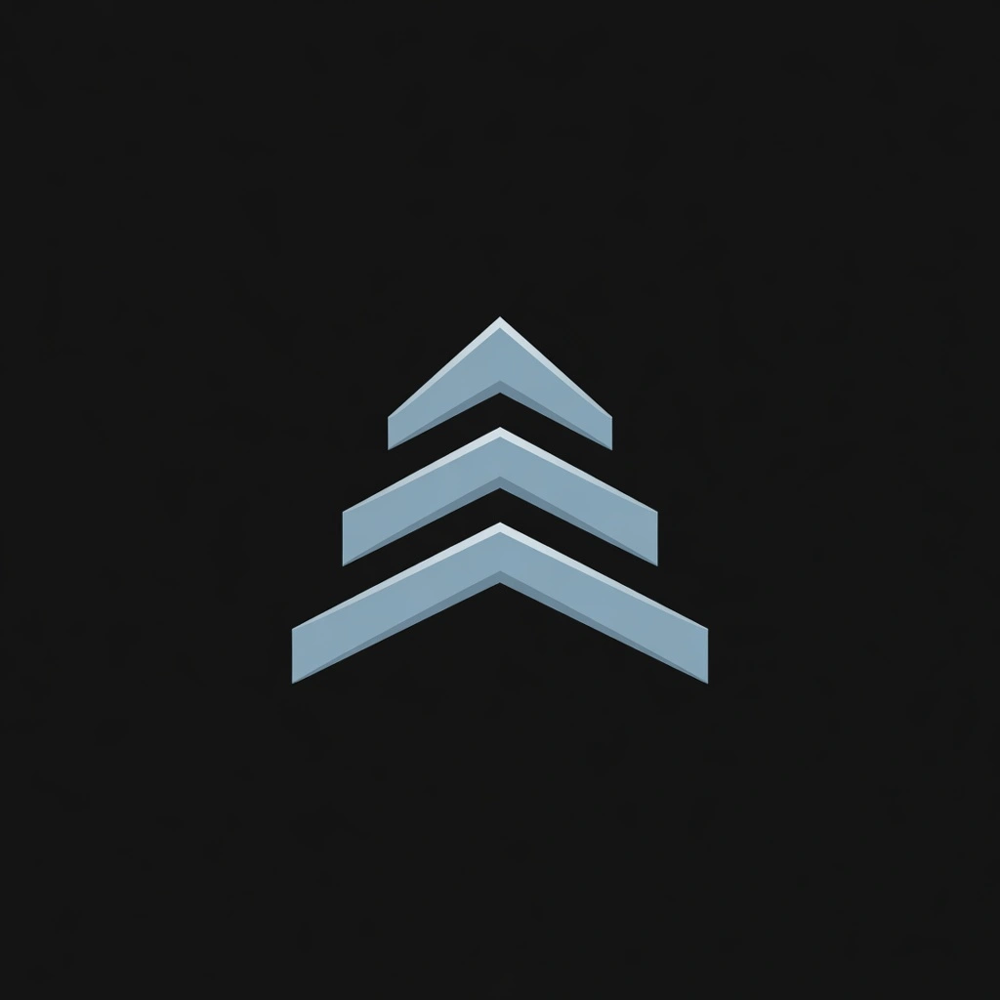

<p align="center">
  
</p>

<h1 align="center">AlpenSync</h1>

<p align="center"><strong>Sync Proton contacts to GrapheneOS.</strong></p>

<p align="center">
  Two-way contact sync through the stock Contacts app.<br>
  Like iCloud Contacts, without Apple or Google.
</p>

<p align="center">
  <a href="https://alpensync.org">alpensync.org</a>
</p>

<p align="center">
  <a href="https://alpensync.org"></a>
  <a href="LICENSE"></a>
  <a href="#status"></a>
  <a href="#status"></a>
  <a href="#status"></a>
</p>

<p align="center">
  <a href="#what-it-does">What it does</a> ·
  <a href="#how-sync-works">How sync works</a> ·
  <a href="#read-this-first">Read this first</a> ·
  <a href="#build">Build</a> ·
  <a href="PRIVACY.md">Privacy</a> ·
  <a href="TERMS.md">Terms</a> ·
  <a href="LICENSE">License</a>
</p>

<p align="center">
  
</p>

Site: [alpensync.org](https://alpensync.org). Source: this repository.

AlpenSync is an independent, GPL-3.0 Android client that syncs [Proton Mail](https://proton.me) contacts with the phone you actually use. It is built for [GrapheneOS](https://grapheneos.org) and other de-Googled Android. There is no Google account, no Play Services, and no AlpenSync server. The durable copy of your address book is Proton.

It is **not affiliated with, endorsed by, or supported by Proton AG** or the GrapheneOS project.

## What it does

GrapheneOS does not give you a Google account to hold your address book. AlpenSync is the pipe between Proton and Android's native contacts, so the stock dialer, messengers, and Contacts app just work.

- **On this phone.** Add or change someone in Contacts. AlpenSync sends that to Proton.
- **On Proton.** Change a number in Proton Mail. AlpenSync brings it back here.
- **If you wipe or lose the phone.** The book is still in Proton. Sign in again and pull it down.

Contacts are written into Android's system Contacts provider, so they behave like any other native contact. Cryptography runs on the device. The app is a client, never a relay.

Calendar and mail are later. Same core, still without Google.

## How sync works

1. Sign in to Proton in the app (password, 2FA, and Proton's human check when it asks).
2. Grant Contacts access so the stock app and dialer can see the book.
3. Pull your Proton contacts onto the phone.
4. Edits on the phone go up on their own. They do not wait for the interval.
5. Changes on the web or another device come down on your schedule. **Sync now** pulls immediately.

If Proton drops the session, AlpenSync tells you and keeps a notice up until you sign in again. Contacts already on the phone stay put.

AlpenSync only writes its own account on the device. It does not scan Phone, Google, or Samsung contact stores, and it does not auto-merge people you already had on the handset.

## Read this first

1. **Unofficial API.** AlpenSync talks to Proton through Proton's undocumented API. Sync may break when Proton changes something.
2. **Decrypted on the phone.** Contacts live decrypted in Android's system provider. That is how the dialer sees them. Same exposure as any contacts sync app.
3. **No telemetry.** Traffic goes only to Proton hosts. You can read that in the source.
4. **Independent.** Not Proton. Not GrapheneOS. Not a store listing. The source is the product.
5. **GrapheneOS is the target.** Other OEM Contacts apps (Samsung in particular) may not offer "save to AlpenSync" for new contacts. Two-way update of an already-pulled AlpenSync contact still works. Create and delete of brand-new local contacts is verified on GrapheneOS.

Two-password Proton accounts (a separate mailbox password) are not supported yet.

## Status

In development. Two-way contact sync works: pull, push of edits, create, and delete, plus a persistent outbox if the network drops. There is no Play Store build and no F-Droid listing yet. Install from source.

| | |
| --- | --- |
| Package | `app.alpensync` |
| Min Android | 8.0 (API 26) |
| Play Services | None |
| FCM / Firebase | None |
| Telemetry | None |
| Network | Proton hosts only |
| License | [GPL-3.0-only](LICENSE) |

## Build

You need a current Android SDK (compile SDK 36) and JDK 17+.

```powershell
git clone https://github.com/WFT345/AlpenSync.git
cd AlpenSync
.\gradlew.bat :app:installDebug
```

On macOS or Linux, use `./gradlew :app:installDebug`.

The debug APK is a sideload. Review [privacy](PRIVACY.md) and [terms](TERMS.md) before you sign in with a real Proton account.

## Privacy and terms

- [Privacy policy](PRIVACY.md). No telemetry. No AlpenSync account. Traffic only to Proton.
- [Terms of use](TERMS.md). GPL-3.0 wins if a term conflicts with the license.
- [llms.txt](llms.txt). Short machine-readable summary for crawlers and assistants.

## License

AlpenSync is licensed under the [GNU General Public License v3.0](LICENSE).

The bundled Inter font is under the [SIL Open Font License](app/third_party/inter/OFL.txt).

Proton and related marks belong to Proton AG. GrapheneOS is a trademark of the GrapheneOS project. AlpenSync uses those names only to describe compatibility.
